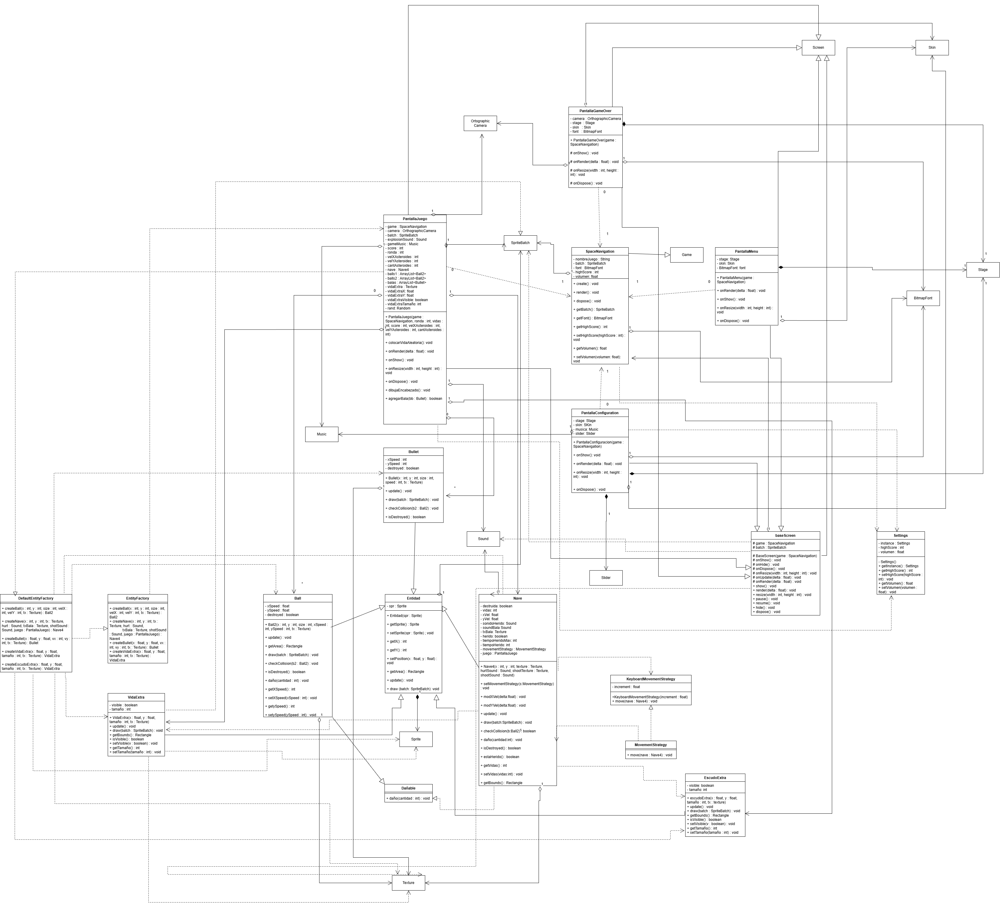

# SpaceNav2024

Proyecto realizado en Java usando LibGDX.

## 🚀 Cómo ejecutar el juego

### Requisitos

- **Java JDK 17** o superior
- **NetBeans**, **IntelliJ IDEA** o **Eclipse**
- **Gradle** (opcional, ya viene el wrapper)

### Ejecución rápida en NetBeans

1. Clona el repositorio:
    
    ```bash
    git clone <https://github.com/FelipeRomero19/Juego-Programacion-Avanzada.git>
    ```
    
2. Abre NetBeans y selecciona **File > Open Project**, luego elige la carpeta del repositorio.
3. Ve al subproyecto `lwjgl3`, expande **Source Packages [java]** y abre el archivo
    
    `puppy.code.lwjgl3.Lwjgl3Launcher.java`.
    
4. Haz clic derecho y selecciona **Run File**.

### Ejecución en Eclipse

1. Clona el repositorio:
    
    ```bash
    git clone https://github.com/FelipeRomero19/Juego-Programacion-Avanzada.git
    ```
2. Abre Eclipse y selecciona **File > Import...**
3. Elige **Gradle > Existing Gradle Project** y haz clic en **Next**.
4. Selecciona la carpeta del repositorio y termina el asistente de importación.
5. Ve al subproyecto `lwjgl3`, expande **src/main/java** y abre el archivo  
   `puppy.code.lwjgl3.Lwjgl3Launcher.java`.
6. Haz clic derecho sobre el archivo y selecciona **Run As > Java Application**.

### Ejecución por terminal

Puedes ejecutar el juego con Gradle usando:

```bash
./gradlew :lwjgl3:run
```

En Windows:

```bash
gradlew.bat :lwjgl3:run
```

---

## Estructura del proyecto

- **core**: Lógica principal del juego compartida por todas las plataformas.
- **lwjgl3**: Plataforma principal de escritorio (antes llamada 'desktop').

---

## Diagrama UML

El diagrama UML principal del proyecto puede consultarse y descargarse desde [`documentos/UML-Juego.drawio.png`](documentos/UML.drawio.png):




---

